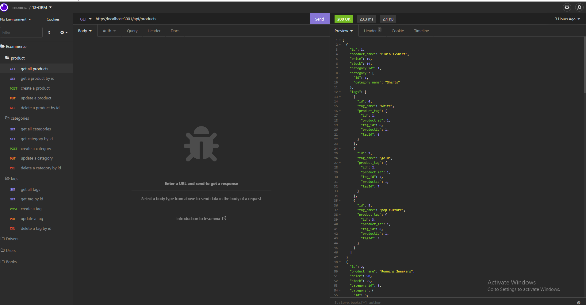
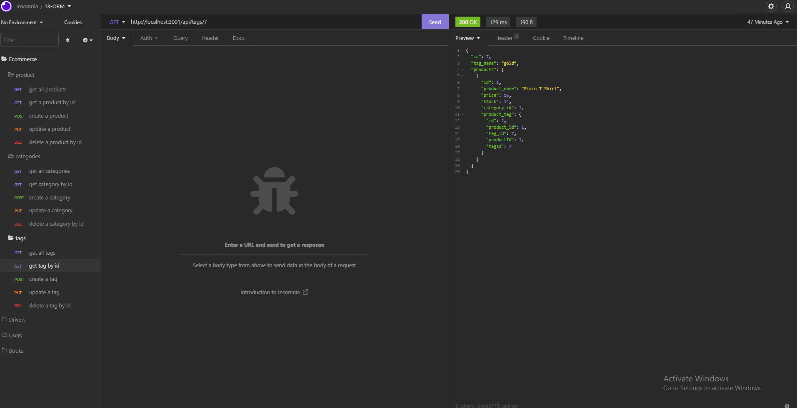
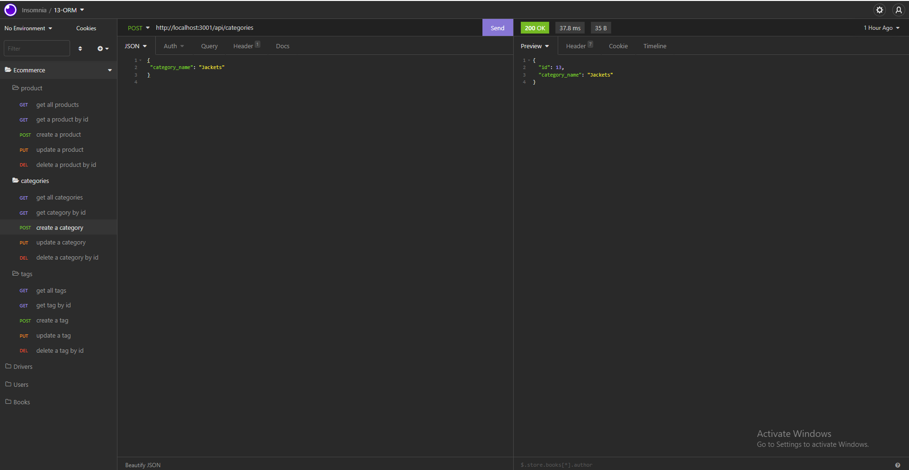

# EcommerceBackEnd

## Table of Contents
1. [Description](#description)
2. [Visuals](#visuals)
3. [Resources](#resources)

## Description
This is the back end build for an application that helps shop owners big and small keep track of inventory. This build uses mySQL and express.js API, to accomplish this and support the CRUD operations. By using nodemon in the command line and starting the application you are able to run these operations. The seed data is populated by running 'npm run seed'. 

## Visuals

## Resources
- [VideoLink]()
- [Repository](https://github.com/selaprivette/EcommerceBackEnd)